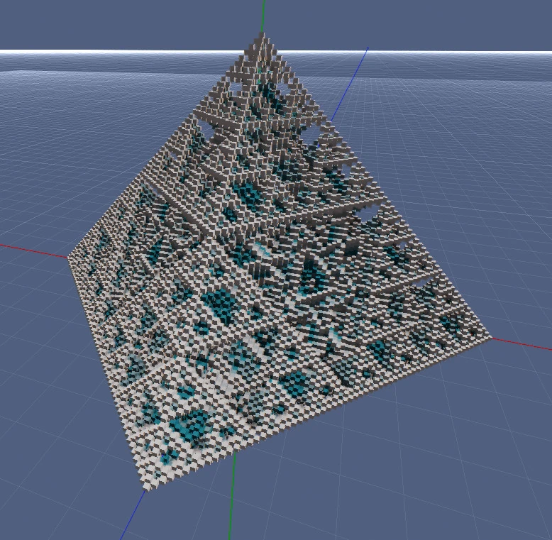
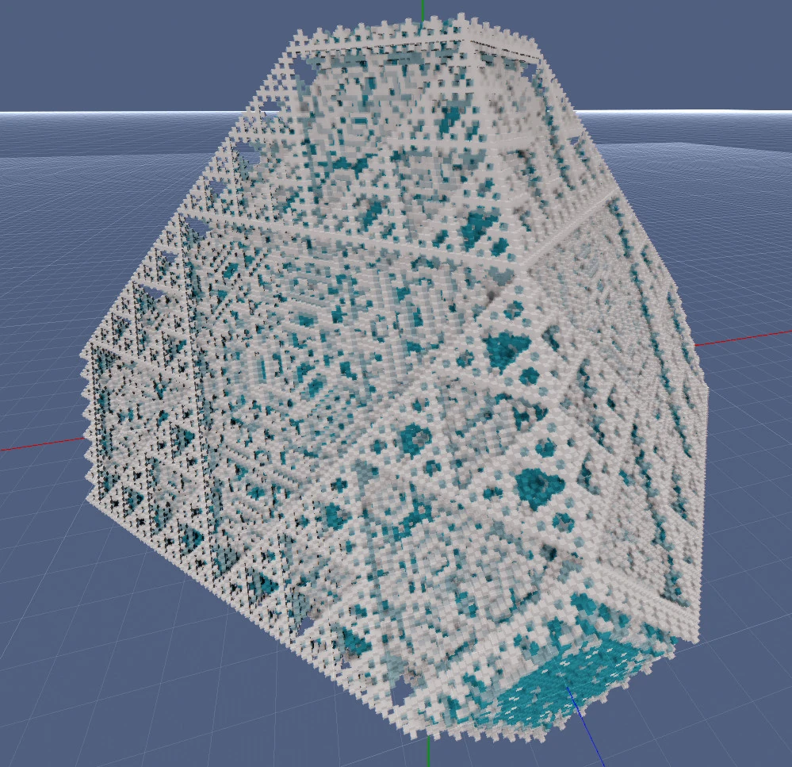
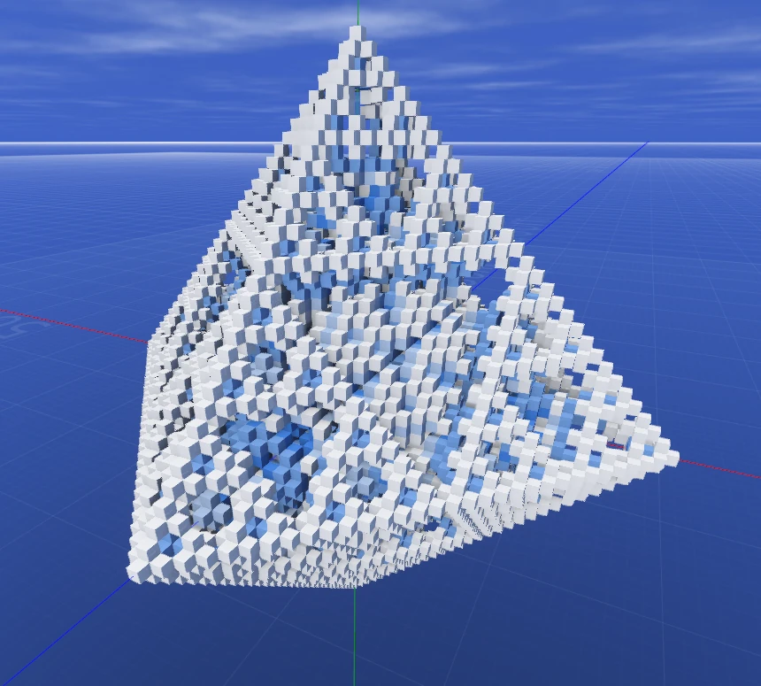
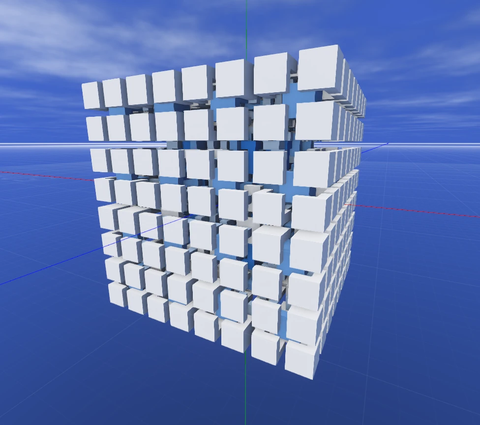
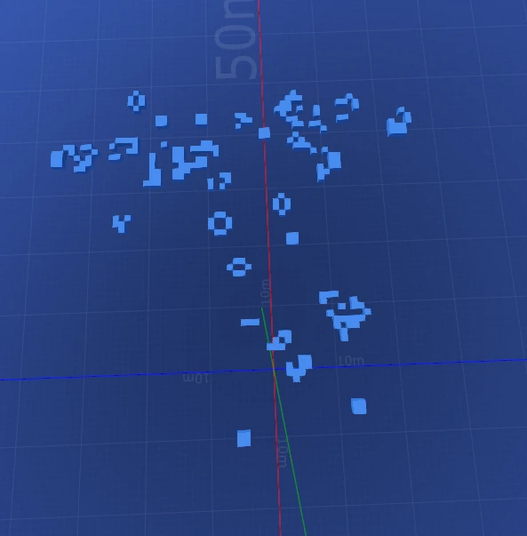

# Cellular Automata

This is an experiment with cellular automata inspired by [Tantan](https://www.youtube.com/watch?v=63qlEpO73C4&ab_channel=Tantan).
It's also a functional mod(ule) for [Rem's Engine](https://github.com/AntonioNoack/RemsEngine).

When experimenting, I found the [Sierpinski Triangle](https://en.wikipedia.org/wiki/Sierpi%C5%84ski_triangle) the easiest to type in + most interesting:
births = 1, survives = 0, states = 5.

The following images show the cellular automate with those settings:

(Yes, Rem's Engine has become more colorful 😄)

When using a Moore-Neighborhood (full 3x3x3 cube) instead of a Von-Neumann-Neighborhood (just direct neighbors),
the sierpinski-triangle becomes cubic:

The current build also has presets for Conway's Game Of Life:

## Building

This is a mod for Rem's Engine, so first build the engine. Then you can build this project, e.g. with Intellij Idea.
There are no dependencies besides my engine.

## Run Sample

Visit the [releases page](https://github.com/AntonioNoack/CellularAutomata/releases), download and run it.
I might create a web-build in the future.
