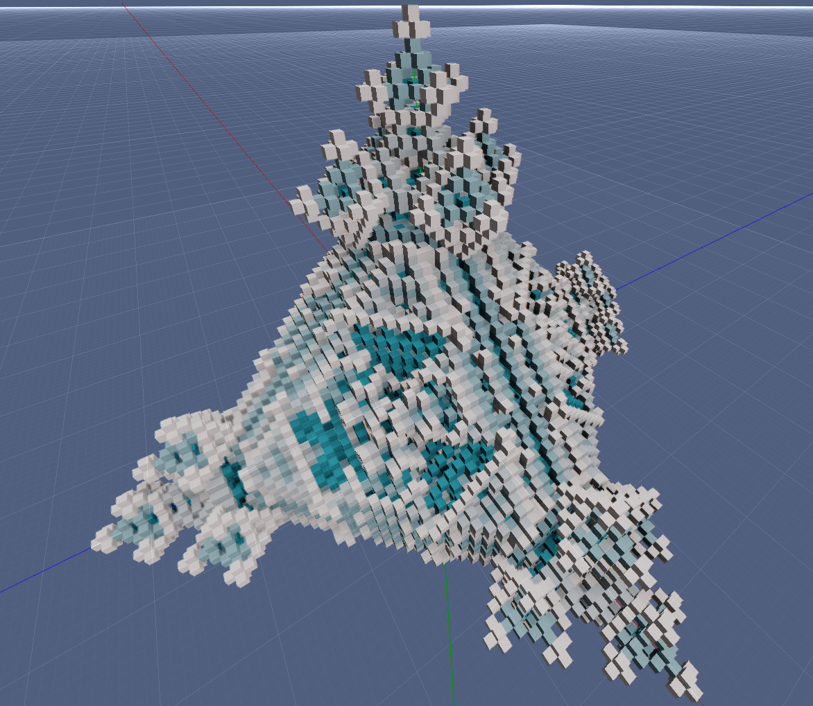

# Cellular Automata

This is an experiment with cellular automata. A functional mod for [Rem's Engine](https://github.com/AntonioNoack/RemsEngine).

When experimenting, I found the [Sierpinski Triangle](https://en.wikipedia.org/wiki/Sierpi%C5%84ski_triangle) the easiest to type in + most interesting:
births = 1, survives = 0, states = 5.

The following images show the cellular automate with those settings:

I was inspired to experiment with cellular automata by [Tantan](https://www.youtube.com/watch?v=63qlEpO73C4&ab_channel=Tantan).

## Building

This is a mod for Rem's Engine, so first build the engine. Then you can build this project, e.g. with Intellij Idea.
There are no dependencies besides my engine.

## Run Sample

I've compiled a version including the dependencies into [Demo.jar](out/artifacts/Demo/Demo.jar). It should run on Windows and Linux.

## Simulation

My focus went more towards GPU optimizations, because they were the bottleneck at 50³ cells at the start.
Now, the CPU performance could be improved substantially, e.g. by using good multithreading.
Later, I added a GPU solver.
Transferring the data from GPU back to CPU isn't implemented yet.

## Visualization

First I implemented the visualization using instanced rendering & blocks. I added a MeshSpawner for that purpose into my engine (CellularAutomaton1).
However, probably because of overdraw, the performance was quite bad, and a fractal cube with 50³ cells already caused my RX580 to go down to 30fps at 1080p.

I then tried to create chunks like in Minecraft, just to see what the performance would be. Unsurprisingly, it was no better.

Then I tried raytracing within the cells boundaries. This was a large win, and brought my fps back to 160 in 1080p (CellularAutomaton2).
First I used the front face of the bounds-cuboid as a ray-starting point and a mask of where to raytrace. But this made movement inside the cell volume inpossible.
I then rewrote the shader such that you're able to render from any point. The mask is now the backside of the cuboid.

Since this shader may be useful for other projects, e.g. similar ones to [Teardown](https://teardowngame.com/), I also integrated it into [my engine](https://github.com/AntonioNoack/RemsEngine).